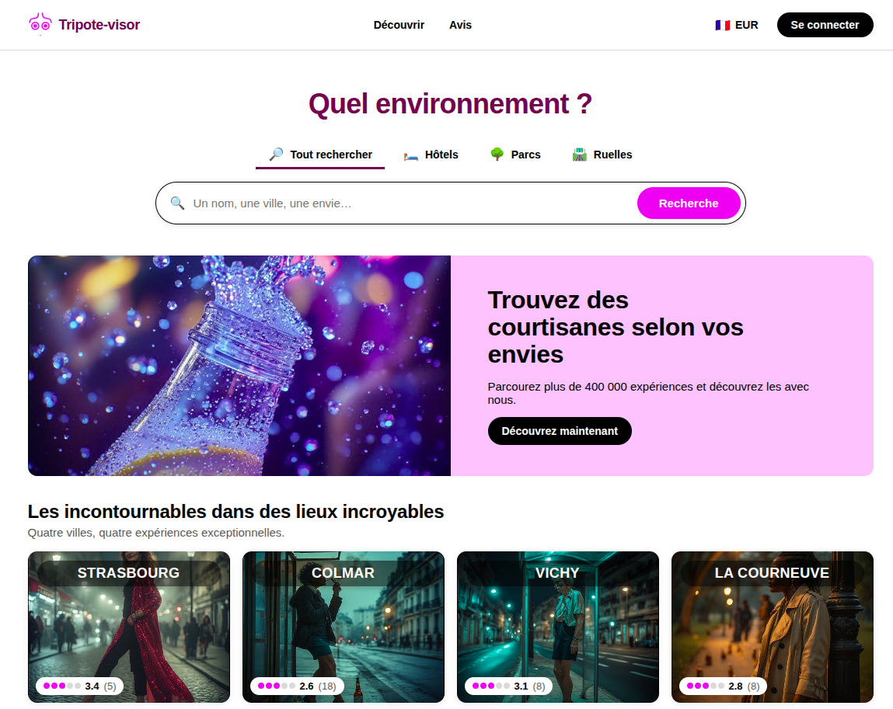

# Tripote-visor

> A Vue 3 front-end demonstration that uses the polished UI of a major travel
> review platform to ask an uncomfortable question.

🌐 **Live demo:** [tripote-visor.vercel.app](https://tripote-visor.vercel.app)



## ⚠️ Subject matter

This project is **a parody**. Its premise is deliberately uncomfortable: it
imagines what a polished travel review platform would look like if, instead
of indexing hotels and restaurants, it indexed sex workers with client-facing
reviews and rankings. Every profile, photo, review, name, city, price and
location is fictional — there is no backend, no database, no real listing,
no real person.

The discomfort the name produces is intentional. The gap between a polished
interface and the topic it claims to organise is the whole point.

That said, **the reality the site evokes is not a joke.** According to the
International Labour Organization, millions of people worldwide are victims
of trafficking for sexual exploitation — the overwhelming majority of them
women and girls. Many people in prostitution were coerced, debt-bonded or
recruited under false promises; their daily lives are shaped by physical
violence, psychological harm and severe precarity. Demand — from clients,
intermediaries and online platforms — directly funds the criminal networks
that make this exploitation possible. Paying for sexual services is therefore
not a neutral act: it weighs on other lives.

**Helplines** if you are a victim or witness of trafficking:

- 🇫🇷 France — `119` (child endangerment) and the Ac.Sé network `+33 8 25 00 99 07`
- 🇪🇺 EU — `116 006` (victims of crime helpline)

The site re-states this warning under the `SeriousNote` callout on the home
page (collapsed) and on `/about`, `/safety`, `/terms`.

## Concept

Tripote-visor reproduces, with care, the visual grammar of a mainstream
travel review platform: a tabbed search bar, age-bucket vignettes, a
"discover" page with a top-4 ranking, listing pages with sort controls,
a press-style "Encounter Stories" magazine, profile pages with photo
galleries, weekly schedules, reviews with ratings and language tags,
maps embedded via OpenStreetMap. The UI is friendly, polished, accessible.

The subject it pretends to organise — sex workers — is not. The website's
own copy never lets you forget it: a `SeriousNote` callout sits at the
bottom of the home, on `/about`, `/safety` and `/terms`; the parody is
called out explicitly in the legal mentions; the cookie consent modal
purposely refuses to persist anything. The polish is the trap; the parody
is in the gap.

## Tech stack

- **Vue 3** (`<script setup>` SFCs, Composition API)
- **Vue Router 4** for all internal navigation
- **Vite 5** for dev server + static build
- **Vitest** + **@vue/test-utils** + **jsdom** for unit tests (310 tests)
- **Prettier** for formatting
- **OpenStreetMap** embed for profile maps (no API key, no tracker)
- **AI-generated imagery** for all profile photos

No TypeScript, no state library beyond a small Vue `ref()` store, no CSS
framework, no backend, no analytics, no third-party loaders besides OSM.

## Project structure

```
src/
├── App.vue, main.js, router/
├── pages/                     # 19 page components
├── components/
│   ├── home/                  # blocks composing the home page
│   ├── profile/               # ProfilePage sub-blocks
│   └── modals/                # 4 app-level modals
├── data/                      # raw JSON fixtures (profiles, articles, …)
├── lib/                       # pure-data helpers
├── state/                     # 4-modal open/close store
├── i18n/                      # translations + t() helper
└── styles/                    # CSS tokens + form-page shared
public/
├── profiles/<id>/             # main.jpg + secondary-{1,2}.jpg per profile
├── articles/, cities/, age/, ttd/
└── favicon.*
```

See [AGENTS.md](AGENTS.md) for the full architecture, routing table,
modal contracts, recipes for adding pages / locales / translations, and
the project rules.

## Running locally

```bash
make install        # npm install
make dev            # vite dev on http://localhost:5173
make test           # vitest run (310 tests)
make build          # static build → dist/
make check          # prettier --check + vitest
```

Every target is also a `npm run` script (the Makefile is a thin wrapper).

## License

MIT — see [LICENSE](LICENSE). Made with ❤️ by YavaDeus.
